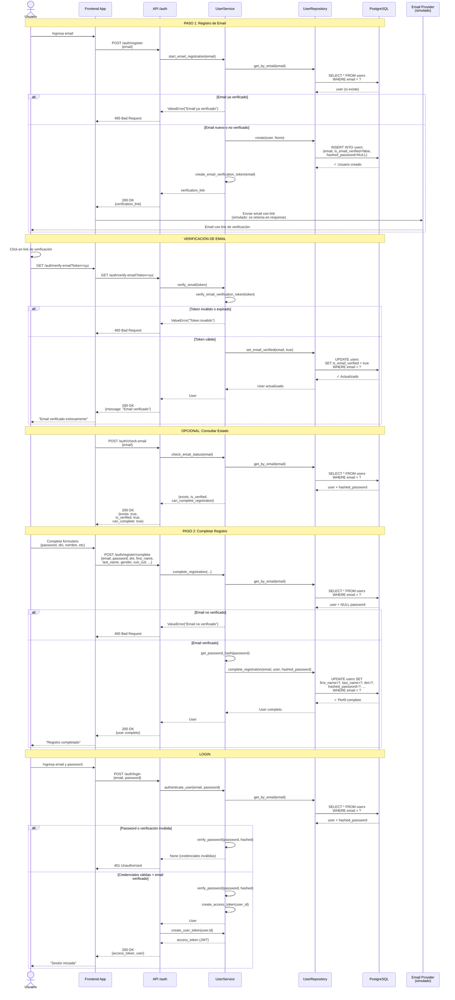

# Diagrama de Secuencia - Registro de Usuarios en Dos Pasos

Este documento describe el flujo completo del registro de usuarios implementado con verificación de email en dos pasos.

## Flujo General



## Endpoints Disponibles

### 1. POST /auth/register

**Paso 1: Registro de email**

**Request:**

```json
{
  "email": "usuario@example.com"
}
```

**Response 200 OK:**

```json
{
  "message": "Se envio el link de verificacion",
  "verification_link": "http://localhost:8000/auth/verify-email?token=eyJhbG..."
}
```

**Response 400 Bad Request:**

```json
{
  "detail": "El email usuario@example.com ya esta verificado"
}
```

---

### 2. GET /auth/verify-email?token={jwt_token}

**Verificación de email mediante token JWT**

**Response 200 OK:**

```json
{
  "message": "Email verificado"
}
```

**Response 400 Bad Request:**

```json
{
  "detail": "Token invalido o expirado"
}
```

---

### 3. POST /auth/check-email

**Consultar estado de verificación de un email**

**Request:**

```json
{
  "email": "usuario@example.com"
}
```

**Response 200 OK:**

```json
{
  "exists": true,
  "is_verified": true,
  "can_complete_registration": true
}
```

---

### 4. POST /auth/register/complete

**Paso 2: Completar perfil después de verificar email**

**Request:**

```json
{
  "email": "usuario@example.com",
  "password": "SecurePass123",
  "dni": "12345678",
  "first_name": "Juan",
  "last_name": "Pérez",
  "gender": "masculino",
  "cuit_cuil": "20123456789",
  "phone": "+5491112345678",
  "nationality": "Argentina",
  "occupation": "Developer",
  "marital_status": "Soltero",
  "location": "Buenos Aires"
}
```

**Response 200 OK:**

```json
{
  "id": "550e8400-e29b-41d4-a716-446655440000",
  "email": "usuario@example.com",
  "full_name": "Juan Pérez",
  "first_name": "Juan",
  "last_name": "Pérez",
  "dni": "12345678",
  "gender": "masculino",
  "cuit_cuil": "20123456789",
  "phone": "+5491112345678",
  "nationality": "Argentina",
  "occupation": "Developer",
  "marital_status": "Soltero",
  "location": "Buenos Aires",
  "is_active": true,
  "is_email_verified": true,
  "created_at": "2026-02-10T12:00:00Z",
  "updated_at": "2026-02-10T12:05:00Z"
}
```

**Response 400 Bad Request:**

```json
{
  "detail": "Email no verificado"
}
```

---

### 5. POST /auth/login

**Iniciar sesión (requiere email verificado y perfil completo)**

**Request:**

```json
{
  "email": "usuario@example.com",
  "password": "SecurePass123"
}
```

**Response 200 OK:**

```json
{
  "access_token": "eyJhbGciOiJIUzI1NiIsInR5cCI6IkpXVCJ9...",
  "token_type": "bearer",
  "user": {
    "id": "550e8400-e29b-41d4-a716-446655440000",
    "email": "usuario@example.com",
    "full_name": "Juan Pérez",
    ...
  }
}
```

**Response 401 Unauthorized:**

```json
{
  "detail": "Credenciales invalidas"
}
```

## Estados del Usuario en BD

### Estado 1: Registro Inicial (Pendiente)

```sql
email: 'usuario@example.com'
is_email_verified: false
hashed_password: NULL
first_name: NULL
last_name: NULL
...
```

### Estado 2: Email Verificado (Puede completar registro)

```sql
email: 'usuario@example.com'
is_email_verified: true
hashed_password: NULL
first_name: NULL
...
```

### Estado 3: Registro Completo (Puede hacer login)

```sql
email: 'usuario@example.com'
is_email_verified: true
hashed_password: '$2b$12$...'
first_name: 'Juan'
last_name: 'Pérez'
dni: '12345678'
...
```

## Validaciones de Seguridad

1. ✅ **Email verificado obligatorio** para completar registro
2. ✅ **Email verificado obligatorio** para login
3. ✅ **Password hasheado** (bcrypt) antes de guardar en BD
4. ✅ **Token JWT con expiración** (24 horas para verificación, 30 min para acceso)
5. ✅ **Password mínimo 8 caracteres**
6. ✅ **No permite re-registro** de emails ya verificados
7. ✅ **Scope en tokens** para prevenir uso indebido (email_verification vs access)

## Configuración

En `config/settings.py`:

```python
SECRET_KEY = "tu-secret-key-super-segura"
ALGORITHM = "HS256"
ACCESS_TOKEN_EXPIRE_MINUTES = 30  # Token de login
EMAIL_VERIFICATION_EXPIRE_MINUTES = 60 * 24  # 24 horas
EMAIL_VERIFICATION_BASE_URL = "http://localhost:8000/auth/verify-email"
```

## Arquitectura

- **Clean Architecture**: separación en capas (API → Service → Port → Adapter → Domain → Data)
- **Async/Await**: operaciones asincrónicas con SQLAlchemy async
- **Repository Pattern**: abstracción de acceso a datos
- **Domain Models**: entidades puras sin dependencias de framework
- **DTO Schemas**: validación con Pydantic v2
